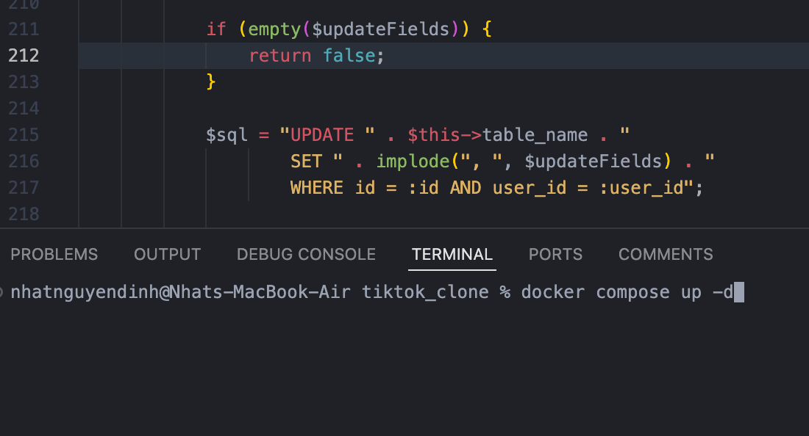
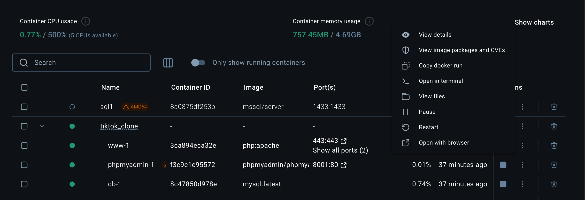
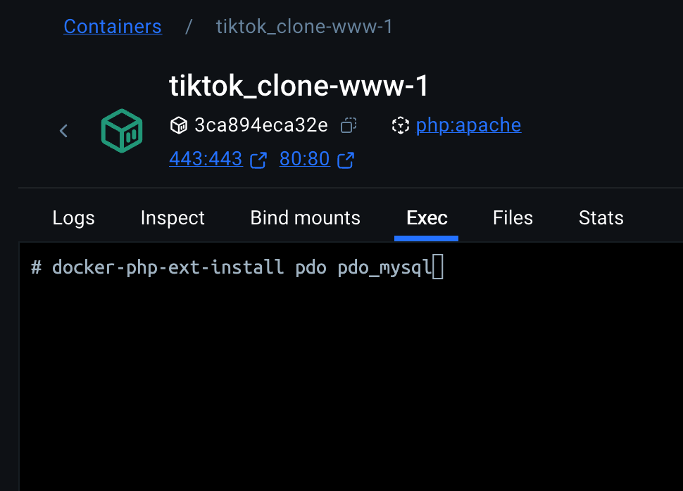
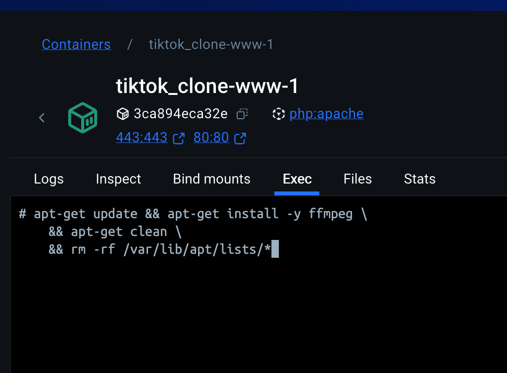
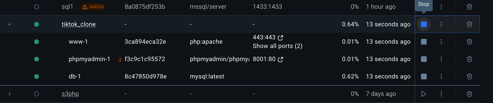

# Cách chạy dự án

## 1 . [Tải docker](https://www.docker.com/products/docker-desktop/)

## 2 . Sau khi tải docker và giải nén thư mục dự án hãy mở terminal của thư mục dự án và chạy lệnh

    - docker compose up -d  ( nếu là Macos)
    - docker-compose up -d ( nếu là Windows)

## 3. Vào container của dự án vừa mới tạo

### Mở terminal của container www-1 (php:apache)

### Tải thư viện sử dụng trong dự án

    Chạy lệnh:

        docker-php-ext-install pdo pdo_mysql

    để tải thư viện làm việc với mysql

    Chạy lệnh :

        apt-get update && apt-get install -y ffmpeg \
        && apt-get clean \
        && rm -rf /var/lib/apt/lists/*

    Để tải thư viện hỗ trợ tạo ảnh thumnail từ video

### Khởi động lại container của dự án

## 4. Truy cập vào [http://localhost/index.php](http://localhost/index.php)
